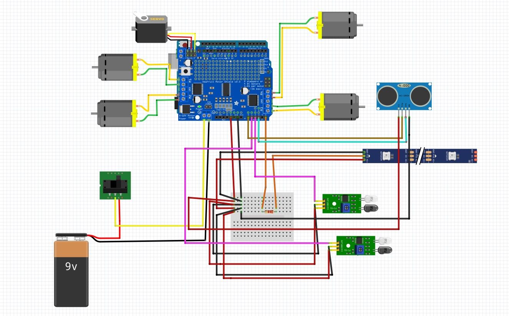
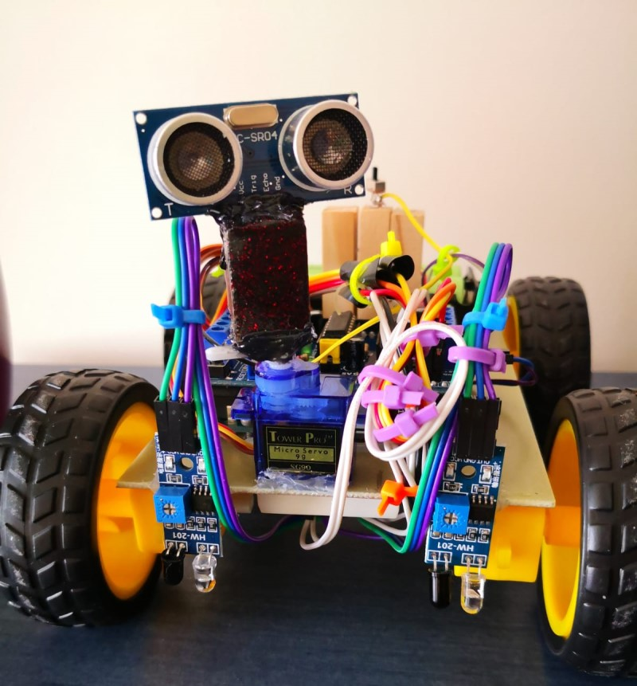
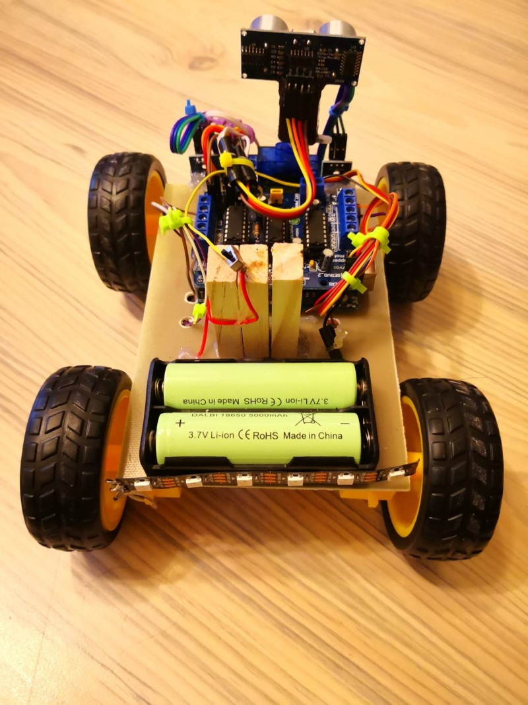
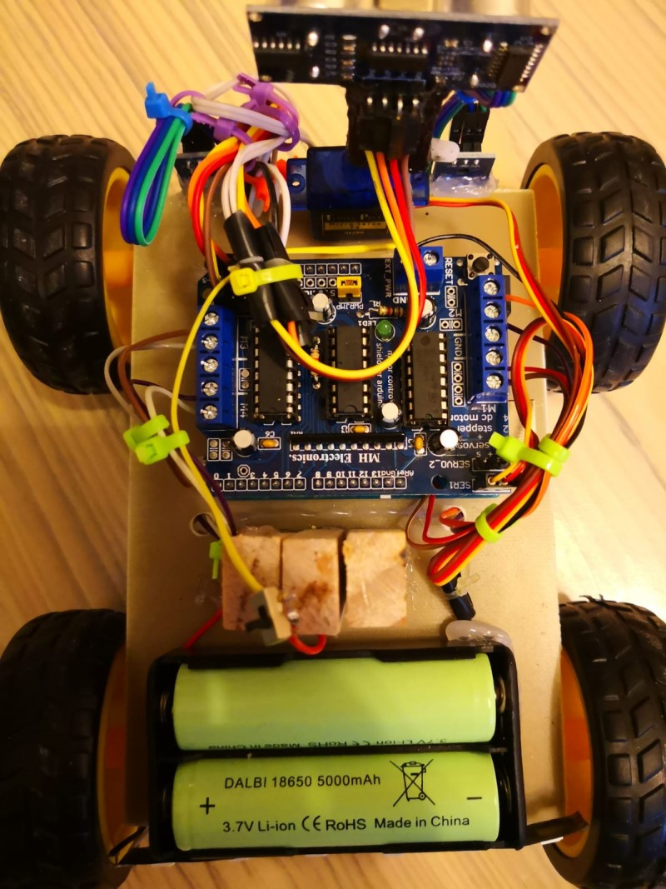
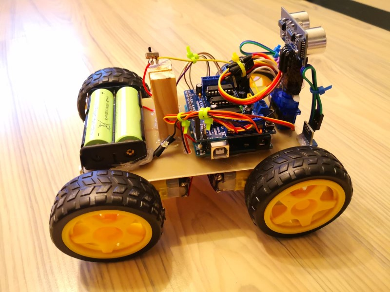
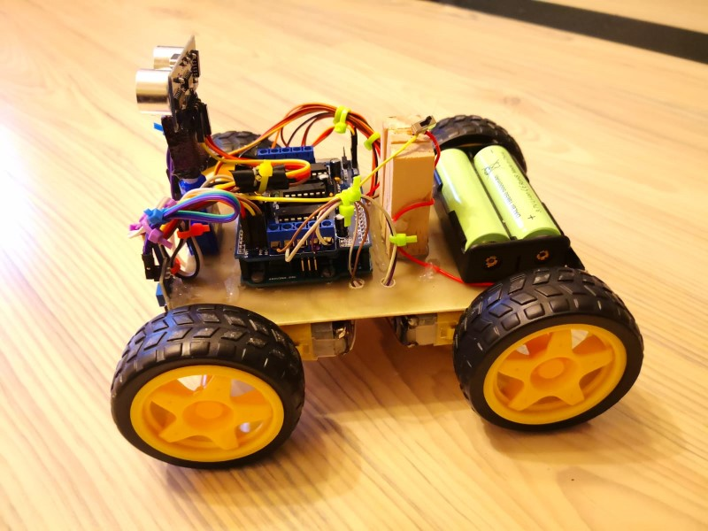
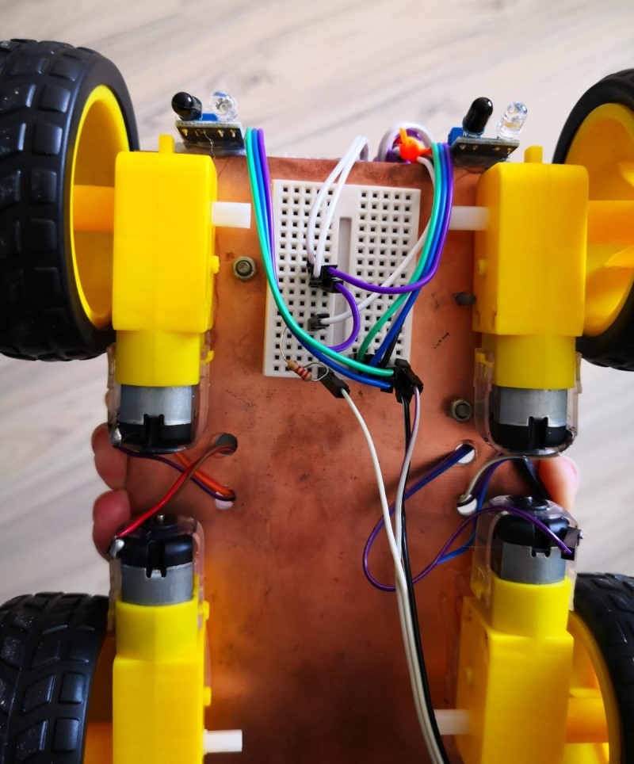

_**Line Follower and Obstacle Avoiding Robot**_

_**Membrii echipa: Pandurita Gabriel si Panaite Andra - Nicoleta**_

_**Introducere**:_

Proiectul consta in construirea unui robot ce urmareste un traseu predefinit si ocoleste toate obstacolele intalnite revenind apoi la traseu. Acesta are la baza o placuta de dezvoltare Arduino UNO echipata cu o placa de control pentru motoare. Robotul folosește un senzor cu ultrasunete pentru a evita coliziunile cu obstacolele si doi senzori infrarosu pentru a urmari traseul.

_**Exemple proiecte similare**_:

1)     https://create.arduino.cc/projecthub/SmartTronics/obstacle-avoiding-robot-using-arduino-and-ultrasonic-sensor-c179bb

Robot ce ocoleste obstacolele si foloseste un sezsor cu ultrasunete si 2 motoare.

2)     https://www.youtube.com/watch?v=1n_KjpMfVT0

Robot ce foloseste un senzor cu ultrasunete, un servomotor si 4 motoare. 

3)     https://www.electronicshub.org/obstacle-avoiding-robot-arduino/

Robot ce foloseste un sensor cu ultrasunete, un servomotor si 2 motoare.

_**Elemente si componente folosite**_:
 * Placa de dezvoltare Arduino UNO
  * 4 motoare de curent continu
  * Un Servomotor
  * Motor Shield Controller
  * Senzor cu ultrasunete HC-SR04
  * 2 senzori infrarosu
  * Tiny BreadBoard
  * Rezistenta 2.2kOhm 
  * 2 Acumulatori Li-Ion 18650
  * Banda cu 6 leduri Neopixels WS2812B
  * Comutator
  * Fire pentru conectare
  * 4 roti
  * Placaj ce sustine montajul

_**Realizarea montajului hardware**_

 Montajul prezentat in Figura 1 a fost realizat prin montarea a patru motoare de curent continu pe placajul de sustinere si un servomotor. Celor patru motoare le-au fost atasate 4 roti ce fac posibila miscarea robotului. Deasupra servomotorului s-a plasat un suport ce sustine senzorul cu ultrasunete, acest lucru facand posibila acoperirea unui perimetru mai mare de catre senzor. Apoi s-a atasat placuta Arduino Uno si placa de control a celor cinci motoare existente in montaj. Cei doi senzori infrarosu s-au atasat pe partea din fata a placajului, pentru a putea detecta liniile existente pe traseu. Montajul contine si un suport pentru cei doi acumulatori ce fac posibila alimentarea si un comutator ce realizeaza tranzitia dintre starea OPRIT catre PORNIT si invers. Banda de leduri Neopixels a fost atasata pe partea din spate a montajului si este utilizata pentru a indica sensul in care robotul urmeaza sa vireze. Conectarea tuturor componentelor a fost realizata prin intermediul placii de control a motoarelor, ce este conectata la placuta Arduino Uno si a unui Tiny BreadBoard ce este atasat pe partea inferioara a placajului, pentru a evita aglomerarea de componente pe partea superioara. 
 In continuare se regaseste o reprezentare schematica a montajului descris:
 
   _**Schema Montajului:**_
  

   _**Stadiul curent al proiectului:**_
      Finalizat.
  
  _**Stadii intermediare ale proiectului:**_

  Montajul actual a fost realizat astfel: Cele 4 motoare DC s-au conectat la Motor Shield Controller, iar acesta s-a conectat la placuta Arduino Uno. S-au montat pini pe Motor Shield Controller si s-au realizat conexiunile pentru senzorul cu ultrasunete, cei doi senzori ultrasrosu si strip-ul de led-uri, prin intermediul unui BreadBoard. Alimentarea montajului este facuta cu ajutorul a 2 acumulatori Li-ion. De asemenea s-a conectat si un ServoMotor caruia i-a fost atasat senzorul cu ultrasunete pentru a permite largirea campului de detectie a acestuia.In final, motoarelor le-au fost atasate roti, astfel montajul realizat sa semene cu o masina.

  _**Video Prezentare:**_
  [https://youtu.be/ixQgXiVvAAI](https://youtu.be/ixQgXiVvAAI)

  
  
  
  
  
  

  _**Descrierea functionalitatilor**_
  
 Pentru montajul descris s-au implementat functionalitati de ocolire a obstacolelor si de urmarire a unui traseu predefinit ce este marcat cu o linie neagra. De asemenea, s-a integrat si o modalitate de indica directia in care urmeaza sa realizeze un viraj atunci cand apare un obstacol pe traseu.
 Pentru a incepe functionarea trebuie actionat comutatorul ce porneste alimentarea circuitului, apoi daca nu este detectat un traseu marcat print-o linie neagra robotul nu va porni. Actionarea motoarelor si pornirea miscarii se va face doar in momentul in care senzorii infrarosu detecteaza prezenta unei linii negre ce indica faptul ca robotul este pe traseu si poate sa continue sau sa inceapa deplasarea. Urmarirea traseului este realizata prin interpretarea valorilor masurate de catre senzorii infrarosu, astfel daca cei doi senzori detecteaza linia neagra miscarea continua, daca doar unul dintre cei doi senzori detecteaza linia neagra, se va realiza un viraj usor in acea directie, iar daca niciunul dintre senzori nu deceteaza linia neagra, miscarea inceteaza. 
 In momentul in care pe traseu se detecteaza un obstacol, robotul se va opri, se va actiona servomotorul pentru a permite senzorului cu ultrasunete sa evalueze imprejurimile, iar ocolirea obstacolului se va face prin directia in care distanta, detectata de senzor, pana la un alt obstacol este mai mare. In momentul in care se ocoleste un obstacol, banda de leduri va efectua un scurt joc de lumini care indica sensul virajului. Odata ce obstacolul a fost ocolit, robotul va reveni la traseul initial si va continua sa se deplaseze de-a lungul acestuia pana la intalnirea unui alt obstacol. Daca pe traseu nu apar obstacole, robotul doar va urmari linia neagra. In videoclipul prezentat mai sus se poate observa cum robotul urmareste traseul marcat, initial liber, iar la o a doua parcurgere a acestuia apare un obstacol intr-un loc aleator si este ocolit cu succes. 
 De asemenea, s-a testat si cazul in care robotul are doua obstacole pe traseu si este conditionat sa il ocoleasca pe acesta printr-o anumita directie. Initial s-a plasat inca un obstacol in partea stanga pentru a forta ocolirea prin dreapta, iar in cazul celui de al doilea obstacol s-a realizat ocolirea prin stanga obstacolului. Se poate regasi in videoclip si cazul in care robotul nu este conditionat de obstacole suplimentare sa ocoleasca print-o anumita directie, astfel acesta decide sa ocoleasca in directia in care distanta fata de un posibil obstacol este mai mare.
 

  _**Descrierea implementarii**_

Pentru implementarea functionalitatii prezentate mai sus s-au integrat biblioteci specifice componentelor utilizate si s-au realizat urmatoarele functii:

1) lookRight() si lookLeft() - actioneaza servomotorul si permit evaluarea existentei de obstacole din dreapta/stanga.
2) moveForward(), moveBackward() , turnRight(), turnLeft() ,  moveStop()- actioneaza cele patru motoare pentru deplasarea inainte/inapoi/stanga/dreapta sau le opreste.
3) chase_right(uint32_t c) si chase_left(uint32_t c) - realizeaza jocul de lumini, catre stanga si dreapta, efectuat in momentul virajelor.
4) readPing() - functie ce returneaza distanta pana la un obiect detectat.
5) obstacleAvoid() - implementeaza ocolirea obstacolelor.

   

